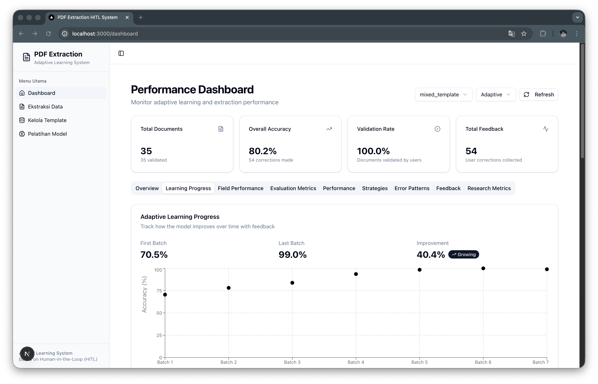
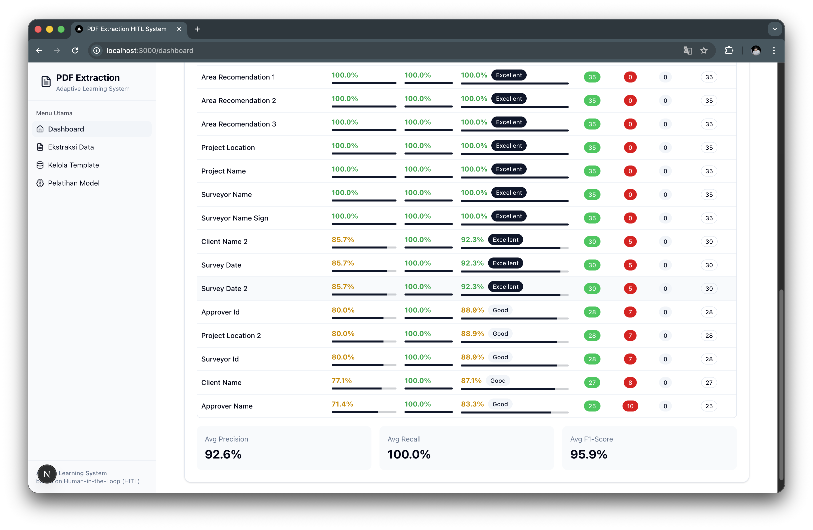
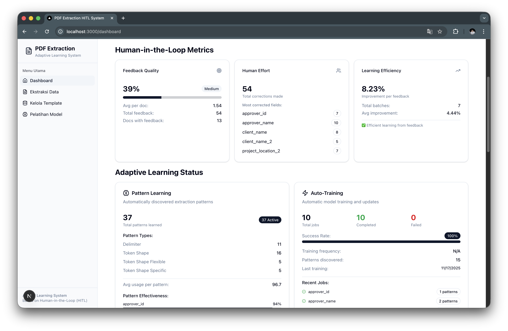
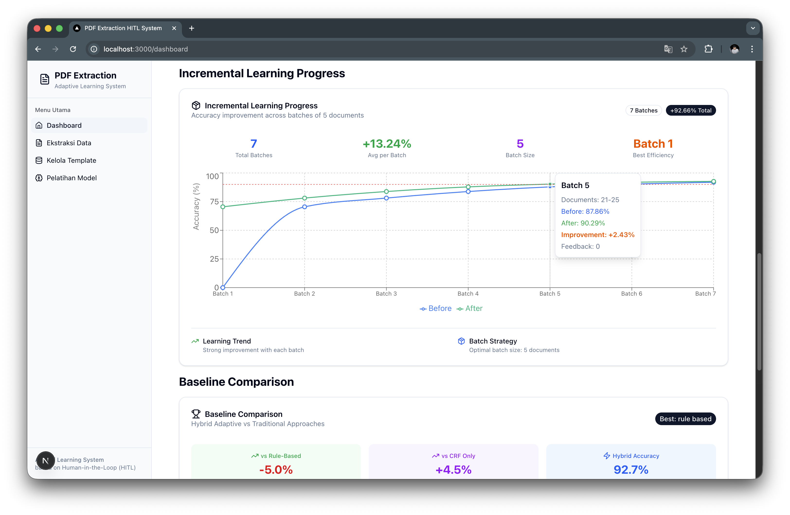
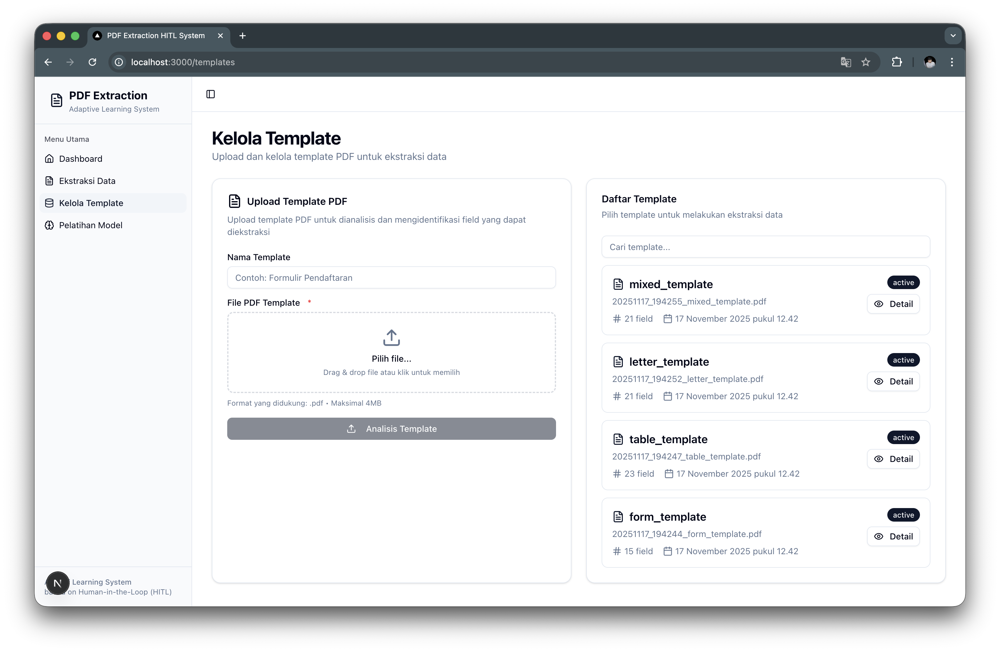
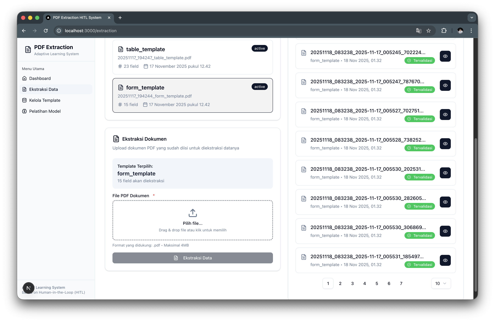
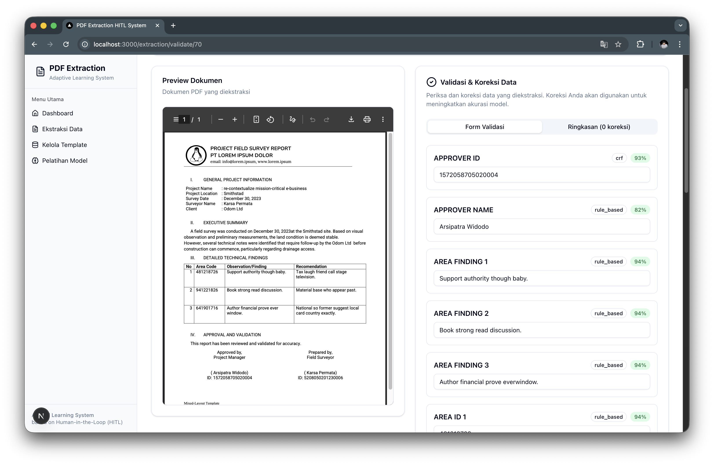
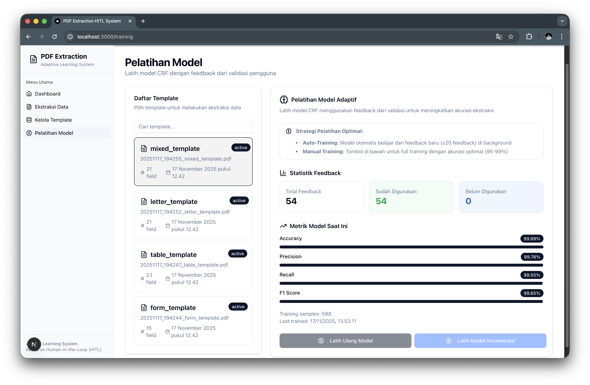

# 🎨 PDF Extraction HITL - Frontend

Modern, responsive web interface for the Adaptive Learning System for PDF Template Data Extraction with Human-in-the-Loop.


---

## 📋 Table of Contents

- [Overview](#overview)
- [Features](#features)
- [Tech Stack](#tech-stack)
- [Getting Started](#getting-started)
- [Project Structure](#project-structure)
- [User Interface](#user-interface)
- [API Integration](#api-integration)
- [Development](#development)
- [Build & Deploy](#build--deploy)

---

## 🎯 Overview

This is the frontend application for the PDF Extraction HITL system, built with **Next.js 15** and **React 19**. It provides an intuitive interface for:

- 📄 **Template Management** - Upload and configure PDF templates
- 🔍 **Document Extraction** - Extract data from PDF documents
- ✏️ **Feedback & Correction** - Provide corrections for extracted data
- 🤖 **Model Training** - Train and manage CRF models
- 📊 **Performance Monitoring** - Track accuracy, learning progress, and metrics
- 📈 **Research Dashboard** - Visualize experimental results and analysis

---

## ✨ Features

### 🔐 Authentication
- Secure login and registration
- JWT-based authentication
- Protected routes
- Session management

### 📄 Template Management
- Upload PDF templates
- Configure extraction fields
- Preview template structure
- Field type configuration (text, date, number, table)
- Validation rules setup

### 🔍 Document Extraction
- Batch document upload
- Real-time extraction progress
- Confidence score visualization
- Strategy selection (Rule-based, CRF, Hybrid)
- Extraction results preview

### ✏️ Feedback & Correction
- Interactive correction interface
- Field-by-field validation
- Bulk correction support
- Feedback history tracking
- Correction rate monitoring

### 🤖 Model Training
- Manual training trigger
- Incremental training
- Training progress monitoring
- Model performance metrics
- Training history

### 📊 Dashboard & Analytics
- **Learning Progress** - Accuracy improvement over time
- **Evaluation Metrics** - Precision, Recall, F1-Score
- **Research Metrics** - Error reduction, learning efficiency
- **Incremental Learning** - Batch-by-batch performance
- **Field Performance** - Per-field accuracy analysis
- **HITL Metrics** - Correction rate, user effort
- **Error Patterns** - Common error categories

---

## 🛠️ Tech Stack

### Core
- **[Next.js 15](https://nextjs.org/)** - React framework with App Router
- **[React 19](https://react.dev/)** - UI library
- **[TypeScript](https://www.typescriptlang.org/)** - Type safety

### Styling
- **[TailwindCSS](https://tailwindcss.com/)** - Utility-first CSS
- **[shadcn/ui](https://ui.shadcn.com/)** - Re-usable components
- **[Lucide Icons](https://lucide.dev/)** - Beautiful icons

### Data Visualization
- **[Recharts](https://recharts.org/)** - Composable charting library
- **[Victory](https://formidable.com/open-source/victory/)** - Data visualization

### State Management
- **React Context API** - Global state
- **React Hooks** - Local state

### HTTP Client
- **Axios** - Promise-based HTTP client

### Form Handling
- **React Hook Form** - Performant forms
- **Zod** - Schema validation

---

## 🚀 Getting Started

### Prerequisites

- **Node.js** 18.0 or higher
- **npm** 8.0 or higher
- Backend API running on `http://localhost:5000`

### Installation

```bash
# Clone the repository
git clone https://github.com/madulinux/pdf-extraction-hitl.git
cd pdf-extraction-hitl/frontend

# Install dependencies
npm install

# Create environment file
cp .env.local.example .env.local

# Edit .env.local with your configuration
nano .env.local
```

### Environment Variables

Create `.env.local` file:

```env
# API Configuration
NEXT_PUBLIC_API_URL=http://localhost:5000/api

# App Configuration
NEXT_PUBLIC_APP_NAME=PDF Extraction HITL
NEXT_PUBLIC_APP_VERSION=1.0.0
```

### Development Server

```bash
# Start development server
npm run dev

# Open browser
# http://localhost:3000
```

### Build for Production

```bash
# Build application
npm run build

# Start production server
npm start
```

---

## 📁 Project Structure

```
frontend/
│
├── app/                          # Next.js App Router
│   ├── (auth)/                  # Authentication pages
│   │   ├── login/               # Login page
│   │   └── register/            # Register page
│   │
│   ├── (main)/                  # Main application pages
│   │   ├── dashboard/           # Dashboard & analytics
│   │   ├── templates/           # Template management
│   │   ├── extraction/          # Document extraction
│   │   └── training/            # Model training
│   │
│   ├── layout.tsx               # Root layout
│   ├── globals.css              # Global styles
│   └── page.tsx                 # Home page
│
├── components/                   # React components
│   ├── ui/                      # shadcn/ui components
│   │   ├── button.tsx
│   │   ├── card.tsx
│   │   ├── dialog.tsx
│   │   ├── form.tsx
│   │   └── ... (50+ components)
│   │
│   ├── auth/                    # Authentication components
│   │   ├── LoginForm.tsx
│   │   ├── RegisterForm.tsx
│   │   └── ProtectedRoute.tsx
│   │
│   ├── extraction/              # Extraction components
│   │   └── ConflictResolution.tsx
│   │
│   ├── shared/                  # Shared components
│   │   └── FileUpload.tsx
│   │
│   ├── app-sidebar.tsx          # Application sidebar
│   ├── DocumentExtraction.tsx   # Document extraction UI
│   ├── ExtractionList.tsx       # Extraction results list
│   ├── FeedbackHistory.tsx      # Feedback history
│   ├── ModelTraining.tsx        # Training interface
│   ├── TemplateList.tsx         # Template list
│   ├── TemplatePreview.tsx      # Template preview
│   ├── TemplateUpload.tsx       # Template upload
│   └── ValidationForm.tsx       # Validation form
│
├── lib/                         # Utilities and helpers
│   ├── api/                     # API clients
│   │   ├── auth.api.ts          # Authentication API
│   │   ├── templates.api.ts     # Templates API
│   │   ├── extraction.api.ts    # Extraction API
│   │   ├── learning.api.ts      # Learning API
│   │   └── client.ts            # Axios client
│   │
│   ├── types/                   # TypeScript types
│   │   ├── auth.types.ts
│   │   ├── template.types.ts
│   │   ├── extraction.types.ts
│   │   ├── learning.types.ts
│   │   ├── dashboard.types.ts
│   │   └── common.types.ts
│   │
│   ├── hooks/                   # Custom React hooks
│   │   ├── useAuth.ts
│   │   └── useTemplates.ts
│   │
│   ├── utils/                   # Helper functions
│   │   └── template-helpers.ts
│   │
│   └── utils.ts                 # Utility functions
│
├── contexts/                    # React contexts
│   └── AuthContext.tsx          # Authentication context
│
├── public/                      # Static assets
│   ├── file.svg
│   ├── globe.svg
│   └── ...
│
├── docs/                        # Documentation
│   └── images/                  # Screenshots
│
├── .env.local.example           # Environment template
├── next.config.ts               # Next.js configuration
├── tailwind.config.ts           # Tailwind configuration
├── tsconfig.json                # TypeScript configuration
├── package.json                 # Dependencies
└── README.md                    # This file
```

---

## 🖼️ User Interface

### 1. Dashboard - Learning Progress

Track accuracy improvement over batches and iterations.



**Features:**
- Learning curve visualization
- Batch-by-batch accuracy
- Baseline vs Adaptive comparison
- Performance metrics cards

---

### 2. Dashboard - Evaluation Metrics

Comprehensive evaluation metrics for model performance.



**Features:**
- Precision, Recall, F1-Score
- Confusion matrix
- Per-template performance
- Field-level metrics

---

### 3. Dashboard - Research Metrics

Research-oriented metrics for academic analysis.



**Features:**
- Error reduction analysis
- Learning efficiency score
- Correction rate trends
- Statistical significance

---

### 4. Dashboard - Incremental Learning Progress

Detailed incremental learning analysis.



**Features:**
- Incremental accuracy growth
- Convergence analysis
- Training samples vs accuracy
- Learning rate visualization

---

### 5. Templates - Upload & Management

Upload and manage PDF templates.



**Features:**
- Drag & drop upload
- Template list with status
- Quick actions (edit, delete, view)
- Template statistics

---

### 6. Templates - Preview & Field Configuration

Preview template structure and configure extraction fields.


**Features:**
- PDF preview
- Field configuration panel
- Field type selection
- Validation rules setup
- Field mapping

---

### 7. Extraction - Document Upload & Results

Upload documents and view extraction results.



**Features:**
- Batch document upload
- Extraction progress tracking
- Results list with confidence
- Strategy indicators
- Quick actions

---

### 8. Extraction - Detail & Feedback

View detailed extraction results and provide corrections.



**Features:**
- Field-by-field results
- Confidence scores
- Strategy used indicator
- Inline correction form
- Feedback submission
- Correction history

---

### 9. Training - Manual & Incremental Training

Trigger model training and monitor progress.



**Features:**
- Manual training trigger
- Incremental training option
- Training progress bar
- Model metrics display
- Training history
- Performance comparison

---

## 🔌 API Integration

### API Client Configuration

```typescript
// lib/api/client.ts
import axios from 'axios';

const apiClient = axios.create({
  baseURL: process.env.NEXT_PUBLIC_API_URL,
  headers: {
    'Content-Type': 'application/json',
  },
});

// Add auth token to requests
apiClient.interceptors.request.use((config) => {
  const token = localStorage.getItem('token');
  if (token) {
    config.headers.Authorization = `Bearer ${token}`;
  }
  return config;
});

export default apiClient;
```

### API Endpoints

**Authentication:**
```typescript
POST /auth/login
POST /auth/register
GET  /auth/me
```

**Templates:**
```typescript
GET    /templates
POST   /templates
GET    /templates/:id
PUT    /templates/:id
DELETE /templates/:id
```

**Extraction:**
```typescript
POST /extract/:documentId
POST /extract/batch
GET  /extract/results/:documentId
```

**Feedback:**
```typescript
POST /feedback
GET  /feedback/document/:documentId
GET  /feedback/template/:templateId
```

**Training:**
```typescript
POST /train/:templateId
GET  /train/status/:templateId
GET  /train/history/:templateId
```

**Performance:**
```typescript
GET /performance/:templateId
GET /performance/dashboard
GET /performance/metrics
```

---

## 💻 Development

### Code Style

```bash
# Lint code
npm run lint

# Format code
npm run format

# Type check
npm run type-check
```

### Component Development

```typescript
// Example: Creating a new component
import { Card, CardContent, CardHeader, CardTitle } from '@/components/ui/card';

export function MyComponent() {
  return (
    <Card>
      <CardHeader>
        <CardTitle>My Component</CardTitle>
      </CardHeader>
      <CardContent>
        {/* Component content */}
      </CardContent>
    </Card>
  );
}
```

### Adding New Pages

```typescript
// app/(main)/my-page/page.tsx
export default function MyPage() {
  return (
    <div className="container mx-auto p-6">
      <h1 className="text-2xl font-bold mb-4">My Page</h1>
      {/* Page content */}
    </div>
  );
}
```

### Custom Hooks

```typescript
// lib/hooks/useMyHook.ts
import { useState, useEffect } from 'react';

export function useMyHook() {
  const [data, setData] = useState(null);
  
  useEffect(() => {
    // Fetch data
  }, []);
  
  return { data };
}
```

---

## 🏗️ Build & Deploy

### Production Build

```bash
# Build for production
npm run build

# Test production build locally
npm start
```

### Docker Deployment

```dockerfile
# Dockerfile
FROM node:18-alpine AS builder
WORKDIR /app
COPY package*.json ./
RUN npm ci
COPY . .
RUN npm run build

FROM node:18-alpine AS runner
WORKDIR /app
COPY --from=builder /app/.next ./.next
COPY --from=builder /app/public ./public
COPY --from=builder /app/package*.json ./
RUN npm ci --only=production

EXPOSE 3000
CMD ["npm", "start"]
```

### Environment-Specific Builds

```bash
# Development
npm run dev

# Staging
NEXT_PUBLIC_API_URL=https://staging-api.example.com npm run build

# Production
NEXT_PUBLIC_API_URL=https://api.example.com npm run build
```

---

## 📊 Performance Optimization

### Image Optimization

```typescript
import Image from 'next/image';

<Image
  src="/image.png"
  alt="Description"
  width={500}
  height={300}
  priority // For above-the-fold images
/>
```

### Code Splitting

```typescript
import dynamic from 'next/dynamic';

const HeavyComponent = dynamic(() => import('./HeavyComponent'), {
  loading: () => <p>Loading...</p>,
  ssr: false, // Disable SSR if needed
});
```

### Caching Strategy

```typescript
// app/api/data/route.ts
export const revalidate = 60; // Revalidate every 60 seconds

export async function GET() {
  const data = await fetchData();
  return Response.json(data);
}
```

---

## 🧪 Testing

### Unit Tests

```bash
# Run tests
npm test

# Run tests with coverage
npm test -- --coverage

# Run tests in watch mode
npm test -- --watch
```

### E2E Tests

```bash
# Run Playwright tests
npm run test:e2e

# Run in UI mode
npm run test:e2e:ui
```

---

## 🐛 Troubleshooting

### Common Issues

**1. API Connection Error**
```bash
# Check if backend is running
curl http://localhost:5000/api/health

# Verify NEXT_PUBLIC_API_URL in .env.local
```

**2. Build Errors**
```bash
# Clear cache and rebuild
rm -rf .next
npm run build
```

**3. Type Errors**
```bash
# Regenerate types
npm run type-check
```

---

## 📚 Resources

### Documentation
- [Next.js Documentation](https://nextjs.org/docs)
- [React Documentation](https://react.dev/)
- [TailwindCSS Documentation](https://tailwindcss.com/docs)
- [shadcn/ui Documentation](https://ui.shadcn.com/)

### Tutorials
- [Next.js Learn](https://nextjs.org/learn)
- [React Tutorial](https://react.dev/learn)
- [TypeScript Handbook](https://www.typescriptlang.org/docs/handbook/intro.html)

---

## 🤝 Contributing

Contributions are welcome! Please see [CONTRIBUTING.md](../CONTRIBUTING.md) for guidelines.

---

## 📄 License

This project is licensed under the MIT License - see [LICENSE](../LICENSE) for details.

---

## 👥 Authors

**Moh Syaiful Rahman**  
GitHub: [@madulinux](https://github.com/madulinux)  
Email: madulinux@gmail.com

---

## 🙏 Acknowledgments

- Built with [Next.js](https://nextjs.org/)
- UI components from [shadcn/ui](https://ui.shadcn.com/)
- Icons from [Lucide](https://lucide.dev/)
- Charts from [Recharts](https://recharts.org/)

---

<div align="center">

**⭐ Star this repository if you find it useful! ⭐**

Made with ❤️ for the research community

</div>
